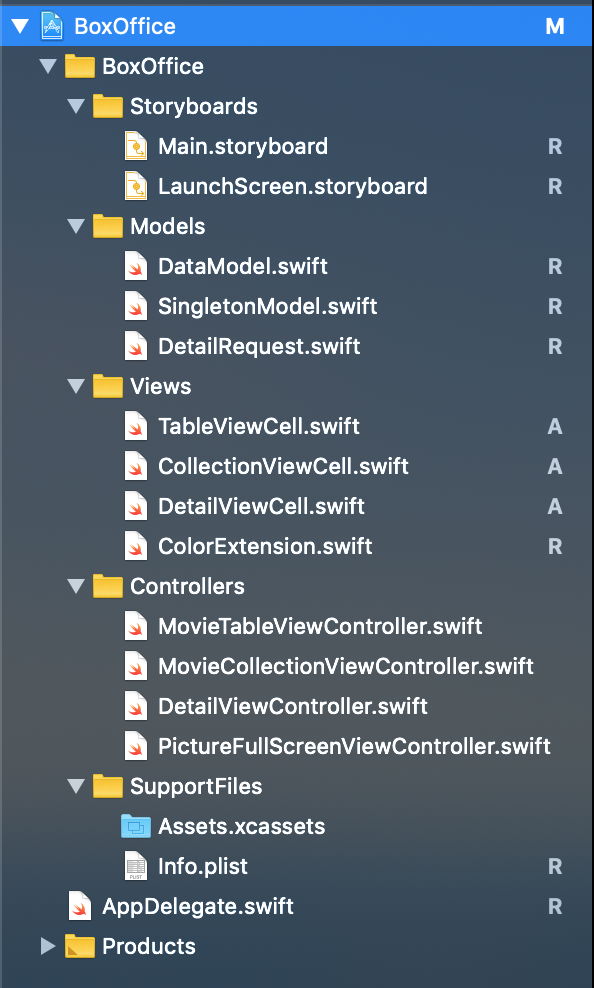

# 부스트캠프 3기 iOS 사전과제
## 영화 박스오피스 앱 

- 선택 요구사항을 포함한 모든 기능을 구현하였습니다.

## 순서
1. 요구사항
1. 구조
1. 구현 전략
1. 앱 시연 동영상 링크

## 요구사항
##  화면1 - 영화목록
### 화면구성
- 탭 인터페이스와 내비게이션 인터페이스의 결합 형태입니다.
- 첫 번째 탭은 'Table', 두 번째 탭은 'Collection' 타이틀로 구성합니다.
- 첫 번째 탭 화면은 테이블형태로, 두 번째 탭 화면은 컬렉션 형태로 같은 데이터를 사용하여 콘텐츠를 표시합니다.
- 테이블 화면
    - 테이블뷰 셀에 영화 포스터를 보여줍니다.
    - 포스터 오른편에 영화정보(제목, 등급, 평점, 예매순위, 예매율, 개봉일)를 보여줍니다.
- 컬렉션 화면
    - 컬렉션뷰 셀에 영화 포스터와 등급을 함께 보여줍니다.
    - 포스터 아래 영화정보(제목, 평점, 순위, 예매율, 개봉일)를 보여줍니다.
- 내비게이션 아이템의 타이틀은 영화 정렬기준을 표시합니다.
- 내비게이션바 오른쪽 부분에는 내비게이션 아이템으로 바 버튼이 있습니다.
    - 바 버튼은 정렬방식을 선택하기 위한 버튼입니다.
### 기능
- 화면 오른쪽 상단 바 버튼을 눌러 정렬방식을 변경할 수 있습니다. (예매율/큐레이션/개봉일 기준)
    - 테이블뷰와 컬렉션뷰의 영화 정렬방식은 동일하게 적용됩니다. 즉, 한 화면에서 변경하면 다른 화면에도 변경이 적용되어 있어야 합니다.
- 테이블뷰와 컬렉션뷰를 아래쪽으로 잡아당기면 새로고침됩니다.
- 테이블뷰/컬렉션뷰의 셀을 누르면 해당 영화의 상세 정보를 보여주는 화면 2로 전환합니다.
## 화면2 - 영화 상세 정보
### 화면구성
- 화면2 내비게이션 아이템 타이틀은 이전 화면에서 선택된 영화 제목입니다.
- 영화 상세정보 화면을 구현합니다.
- 영화 포스터를 포함한 소개, 줄거리, 감독/출연 그리고 한줄평을 모두 포함합니다.
- 한줄평에는 작성자의 프로필, 닉네임, 별점, 작성일 그리고 평을 보여줍니다.
### 기능
- 영화 포스터를 터치하면 포스터를 전체화면에서 볼 수 있습니다.
## 선택 요구사항
- 네트워크 동작중에는 상태표시줄이나 화면에 인디케이터를 표시하세요.
- 데이터 수신을 못하고 실패한 경우에는 알림창으로 사용자에게 안내하세요.

# 구조

- MVC 패턴을 적용하여 앱을 구성했습니다.
- / StoryBoards 
    - Main.storyboard
    - LaunchScreen.storyboard
- / Models
    - 앱을 위한 데이터 모델 구조
    - 싱글턴 인스턴스 모델
    - 데이터 리퀘스트
- / Views
    - 각 뷰에서 사용되는 커스텀 셀 정의
- / Controllers
    - 뷰 컨트롤러
- / SupportFiles
    - info.plist
    - assets

## 구현 전략 

## Singleton Pattern 

앱의 설명을 봤을 때 객체를 하나만 만들어서 사용하면 좋겠다라는 생각이 들어서 싱글턴 패턴을 활용하였습니다. 따라서 앱이 시작되었을때 한번의 요청을 통해서 인스턴스를 초기화 하며, refresh를 하거나 detailView로 들어가기 전에는 요청을 보내지 않습니다.

정렬 기능또한 마찬가지로 들어온 데이터를 통해서 내부적으로 정렬을 하였으며 이 또한 추가적인 API 요청을 보내지 않았습니다. 이는 모두 싱글턴 인스턴스에서 동작합니다.

## Observer Pattern

movie datas & movie Detail에 대한 요청을 비동기 방식으로 처리하였으며, 이 과정에서 imageData 또한 받아오도록 처리하였습니다. 이때 싱글턴 인스턴스에 해당 데이터를 저장하고, 이 과정이 끝난 경우 각 viewController에 Notification을 보내 해당 컨트롤러에서 해당 인스턴스를 활용할 수 있도록 만들었습니다.

요청을 보냈을때 network 에러 혹은 서버쪽에서 데이터를 받지 못한 경우에도 notification을 활용해 Error Notification 을 보내고 해당 viewcontroller에서 alert를 띄우도록 구현해 놓았습니다.

## MVC 

뷰와 모델을 독립적으로 만들었습니다. 옵저버 패턴을 적용하여 컨트롤러에 모델객체의 변화를 알려주면 해당 작업을 뷰를 통해서 하게 됩니다.

- Model
    - 해당 폴더에서 데이터의 요청이나 데이터의 구조등을 정의하였습니다.
    - 싱글턴 패턴 인스턴스 정의 또한 해당 폴더에서 해주었습니다.
- View
    - 각 뷰에서 사용되는 커스텀 뷰 셀을 정의하였습니다.
    - 컨트롤러에서 사용되는 각 뷰의 셀을 정의하는 configure 함수가 정의되어 있습니다.
- Controller
    - 모든 뷰 컨트롤러가 해당 폴더에 정의되어 있습니다.
    - Model에서 데이터를 받으면 View로 연결해줍니다.

## 앱 시연 동영상 링크

[ YouTube ](https://youtu.be/jYeT6EyA_Qo)

